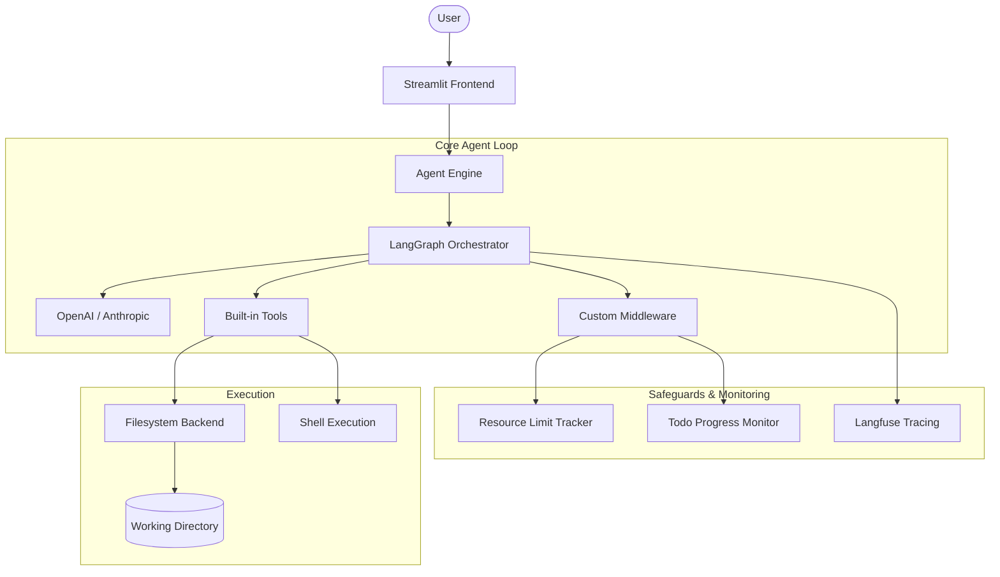

# 🤖 DeepAgent Custom: Autonomous Document Engineer

<p align="center">
  
  
  
  
</p>

---

DeepAgent Custom is a high-performance, autonomous AI agentic system designed to deeply analyze codebases and generate comprehensive technical documentation. Built on **LangGraph** and **LangChain**, it features 20+ specialized personas and rigorous anti-recursion safeguards.

## 🏗️ System Architecture



---

## 📂 Project Structure

-   📂 `app.py`: Main Streamlit application entry point.
-   📂 `agent_engine.py`: Core logic and agent factory.
-   📂 `custom_middleware.py`: Resource tracking and anti-recursion logic.
-   📂 `prompts/`: A library of 23+ specialized system instructions.
-   📂 `deepagents/`: Internal architecture (Graph, Backends, Middleware).

---

## 🚀 Quick Start

### 1️⃣ Clone & Navigate
```bash
git clone <repository_url>
cd DeepAgentCustom
```

### 2️⃣ Automated Setup (Windows)
Double-click `run_setup.bat` or run:
```powershell
.\run_setup.bat
```
*This installs dependencies and creates a virtual environment.*

### 3️⃣ Configuration
Copy `.env.example` to `.env` and provide your keys:
- `OPENAI_API_KEY`: Model access.
- `LANGFUSE_PUBLIC_KEY`: observability.
- `LANGFUSE_HOST`: Tracing dashboard.

### 4️⃣ Launch
```bash
streamlit run app.py
```

---

## ✨ Features

### 🤖 Specialized Agent Personas
Select from over 20+ expert roles tailored for specific domains:

| Category | Personas |
| :--- | :--- |
| **Architecture** | Architect, API Designer, DB Designer, Greenfield Architect |
| **Security** | Auditor, Dependency Analyst, Compliance, Zero-Trust |
| **Quality** | Testing Engineer, Refactoring, Code Reviewer, Test Quality |
| **DevOps** | CI/CD Engineer, Migration Specialist, Microservices Decomposer |
| **Ops** | Performance Optimizer, Incident Analyst, Disaster Recovery |
| **Docs** | Knowledge Extractor, Document Engineer, Legacy Documenter |

### ⚙️ Advanced Capabilities
-   **🗺️ Live Graph Visualization**: Watch the agent "think" with real-time Mermaid diagrams.
-   **📝 Active Planning**: Dedicated tab showing the agent's real-time To-Do list.
-   **⚡ Streaming Execution**: See tool calls and thoughts as they happen.
-   **🌐 Multi-Language**: Generate documentation in English, Chinese, Spanish, and more.

### 🛡️ Anti-Recursion & Efficiency
*Hard-coded safeguards to prevent cost overruns and infinite loops:*
-   **🛑 Stop Conditions**: Hard limit of **50 execution steps** and **30 file reads**.
-   **🎯 Automated Finalization**: Detects 80% task completion to trigger early drafting.
-   **🧠 Heuristic Discovery**: Uses pattern recognition to analyze large directories without walking every file.
-   **📦 Sandboxed FS**: Strict virtual-mode filesystem prevents access outside the working directory.

---

## 🔍 Observability
Powered by **Langfuse**, every decision the agent makes is tracked, scored, and retrievable. Monitor latency, token usage, and tool success rates in real-time.

---

<p align="center">
  Built with ❤️ by the DeepAgent Team
</p>
